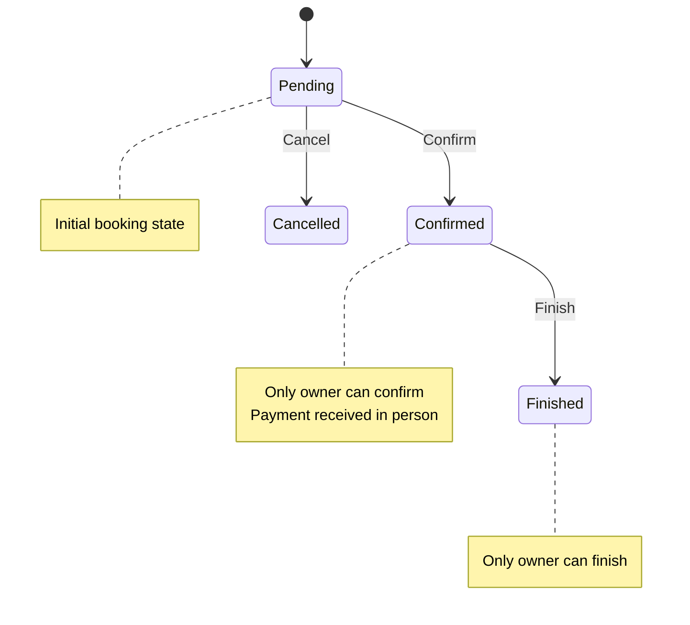
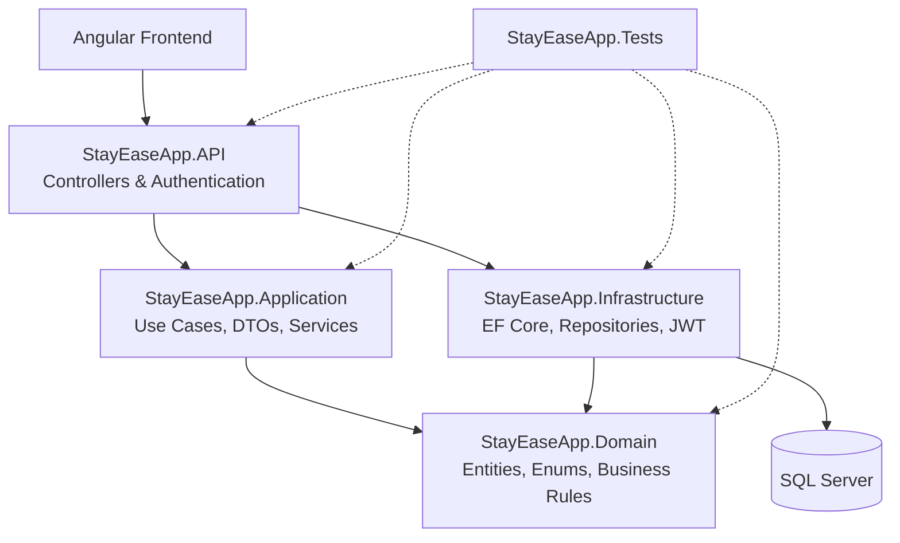

# StayEase 🏠

A modern property rental platform inspired by Airbnb, built with .NET 8 backend and Angular 18 frontend, featuring JWT authentication and comprehensive booking management.

## 📋 Table of Contents

- [Overview](#overview)
- [Features](#features)
- [Architecture](#architecture)
- [Tech Stack](#tech-stack)
- [Getting Started](#getting-started)
- [API Documentation](#api-documentation)
- [Database Schema](#database-schema)
- [Deployment](#deployment)
- [Contributing](#contributing)

## 🎯 Overview

StayEase is a full-stack property rental application that allows users to list properties, search for accommodations, make bookings, and leave reviews. The platform is built following Clean Architecture principles and implements modern security practices with JWT authentication.

## ✨ Features

### Authentication & Authorization
- User registration and login with JWT tokens
- Secure password hashing
- Token-based authentication for protected endpoints
- Role-based authorization (Guest/Owner perspectives)

### Property Management
- Browse all available properties
- View detailed property information
- Create new property listings (authenticated users)
- Delete owned properties with soft delete
- Property ownership validation
- Image support for property listings

### Booking System
- Create bookings with date validation
- View personal booking history
- Get detailed booking information
- Owner's perspective for property bookings
- Guest details for property owners
- Automatic total price calculation
- Booking overlap prevention
- Status tracking (Pending, Confirmed, Cancelled, Finished)

### Booking State Transitions

The booking system follows a state machine pattern with the following transitions:

#### States

- **Pending**: Initial state when a booking is created by a guest.
- **Confirmed**: The property owner has confirmed the booking. Since the system doesn't have integrated payment processing, we assume the guest has paid in person.
- **Cancelled**: The booking has been cancelled by either the property owner or the guest.
- **Finished**: The booking has been completed successfully.

## Transition Rules
### Pending → Confirmed

- Only the property owner can confirm a booking
- Confirmation assumes payment has been received in person

### Pending → Cancelled

- Can be cancelled by either the property owner or the guest
- No confirmation is required to cancel from the pending state

### Confirmed → Finished

- Only the property owner can mark a booking as finished
- Indicates the stay has been completed

> **Note**: This system does not include integrated payment processing. All payments are assumed to be handled externally (e.g., in-person transactions).

#### State Diagram


### Review System
- Leave reviews for properties: only when the booking is in Finished status, the reservation has passed and it is within 30 days after the end date
- Rating system (1-5 stars)
- Comment functionality
- User and property association

## 🏗️ Architecture

The project follows **Clean Architecture** principles, separating business rules from infrastructure and presentation concerns.


backend/<br>
├── StayEaseApp.API              # Presentation layer <br>
├── StayEaseApp.Application      # Application layer <br>
├── StayEaseApp.Domain           # Domain layer <br>
├── StayEaseApp.Infrastructure   # Infrastructure layer <br>
└── StayEaseApp.Tests            # Unit and integration tests <br>

## 🛠️ Tech Stack

### Backend
- **.NET 8** - Modern web framework
- **ASP.NET Core Web API** - RESTful API
- **Entity Framework Core 8.0.5** - ORM
- **SQL Server** - Relational database
- **JWT Bearer Authentication** - Secure token-based auth
- **Swashbuckle 6.5.0** - API documentation (Swagger)
- **BCrypt** - Password hashing

### Frontend
- **Angular 18** - Modern SPA framework
- **TypeScript** - Type-safe JavaScript
- **Ionic Framework** - UI components
- **RxJS** - Reactive programming
- **Angular Router** - Navigation
- **HttpClient** - API communication

### DevOps & Deployment
- **Azure App Service** - Backend hosting
- **Azure Static Web Apps** - Frontend hosting
- **GitHub Actions** - CI/CD pipelines
- **Azure SQL Database** - Production database

## 🚀 Getting Started

### Prerequisites
- .NET 8 SDK
- Node.js 18+ and npm
- SQL Server (LocalDB or Express)
- Visual Studio 2022 or VS Code
- Git

### Backend Setup

1. **Clone the repository**
   ```bash
   git clone https://github.com/shg880106/StayEase.git
   cd StayEase/backend
   ```

2. **Configure database connection**   
   Update `appsettings.json` in `StayEaseApp.API`:
   
   ```bash   
   {
      "ConnectionStrings": {
         "DefaultConnection": "Server=(localdb)\mssqllocaldb;Database=StayEaseDB;Trusted_Connection=true;"
      },
      "Jwt": { "SecretKey": "your-secret-key-min-32-characters", "Issuer": "StayEaseApp", "Audience": "StayEaseApp", "ExpiryMinutes": 60 }
   }
   ```
   
4. **Applydatabase migrations**
   ```bash
   cd src/StayEaseApp.API
   dotnet ef database update
   ```

6. **Run the API**
   ```bash
   dotnet run
   ```
   
API will be available at: `https://localhost:7141`
   Swagger UI: `https://localhost:7141/swagger`

### Frontend Setup

1. **Navigate to frontend directory**
   ```bash
   cd frontend/stayease-app
   ```
   
2. **Install dependencies**
   ```bash
   npm install
   ```

3. **Configure API endpoint**
   Update `src/environments/environment.ts`:
   ```bash
   export const environment = { production: false, apiUrl: 'https://localhost:7141/api' };
   ```
   
4. **Run the application**
   ```bash
   npm start
   ```
App will be available at: `http://localhost:4200`

## 📚 API Documentation

### Auth: Authentication Endpoints

#### Register
```http
POST /api/auth/register
Content-Type: application/json
```
```json
{
  "name": "John Doe",
  "email": "john@example.com",
  "password": "SecurePass123!"
}
```

#### Login
```http
POST /api/auth/login
Content-Type: application/json
```
```json
{
  "email": "john@example.com",
  "password": "SecurePass123!"
}
```

#### Get Current User
```http
GET /api/auth/me Authorization: Bearer {token}
```

### Booking Endpoints (All Auth Required)

#### Create Booking
```http
POST /api/booking Authorization: Bearer {token}
Content-Type: application/json
```
```json
{
  "propertyID": "guid",
  "startDate": "2026-06-01T00:00:00Z",
  "endDate": "2026-06-05T00:00:00Z"
}
```

#### Get My Bookings
```http
GET /api/booking/my-bookings Authorization: Bearer {token}
```

#### Get Booking Details (Guest Perspective)
```http
GET /api/Booking/{bookingId}' Authorization: Bearer {token}
Accept: text/plain
```
```text/plain
{
   "bookingId": "guid"
}
```

#### Get Booking Details (Owner Perspective)
```http
GET /api/booking/my-properties/{bookingId} Authorization: Bearer {token}
Accept: text/plain
```
```text/plain
{
   "bookingId": "guid"
}
```

#### Get all bookings for a specific property (Owner Perspective)
```http
GET /api/booking/property/{propertyId} Authorization: Bearer {token}
Accept: text/plain
```
```text/plain
{
   "propertyId": "guid"
}
```

#### Cancel a booking that belongs to the authenticated user
```http
PATCH /api/booking/{bookingId}/cancel Authorization: Bearer {token}
Accept: text/plain
```
```text/plain
{
   "bookingId": "guid"
}
```

#### Confirms a pending booking (Owner only)
```http
PATCH /api/booking/{bookingId}/confirm Authorization: Bearer {token}
Accept: text/plain
```
```text/plain
{
   "bookingId": "guid"
}
```

#### Finishes a pending booking (Owner only)
```http
PATCH /api/booking/{bookingId}/finish Authorization: Bearer {token}
Accept: text/plain
```
```text/plain
{
   "bookingId": "guid"
}
```

### Property Endpoints

#### Get All Properties
```http
GET /api/property
```

#### Get Property by ID
```http
GET /api/property/{propertyId}
Accept: text/plain
```
```text/plain
{
   "propertyId": "guid"
}
```

#### Create Property (Auth Required)
```http
POST /api/property Authorization: Bearer {token}
Content-Type: application/json
```
```json
{
  "title": "Cozy Beach House",
  "description": "Beautiful oceanfront property",
  "pricePerNight": 150.00,
  "location": "Miami Beach, FL",
  "maxGuests": 4,
  "imageUrl": "https://example.com/image.jpg"
}
```

#### Delete Property (Auth Required)
```http
DELETE /api/property/{propertyId} Authorization: Bearer {token}
Accept: text/plain
```
```text/plain
{
   "propertyId": "guid"
}
```

#### Update Property (Auth Required)
```http
PUT /api/property/{propertyId} Authorization: Bearer {token}
Content-Type: application/json
```
```json
{
   "title": "Updated title",
   "description": "Updated description",
   "pricePerNight": 0,
   "location": "Updated location",
   "maxGuests": 0,
   "imageUrl": "Updated imageUrl"
}
```

#### Get a list with all properties that match the provide search filters
```http
GET /api/property/search/filter
Accept: text/plain
```
```text/plain
{
   "location": "location",
   "minPrice": minPrice,
   "maxPrice": maxPrice,
   "minGuest": minGuest,
   "maxGuest": maxGuest,
   "checkInDate": "checkInDate",
   "checkOutDate": "checkOutDate",
}
```
Sample request with date availability:
```bash
GET /api/property/search/filter?Location=Miami&CheckInDate=2026-06-01&CheckOutDate=2026-06-07
``` 

#### Get all properties owned by the authenticated user
```http
GET /api/property/my-properties Authorization: Bearer {token}
```

### Review Endpoints

#### Get Review by ID
```http
GET /api/review/{reviewId}
Accept: text/plain
```
```text/plain
{
   "reviewId": "guid"
}
```

#### Create Review (Auth Required)
```http
POST /api/review Authorization: Bearer {token}
Content-Type: application/json
```
```json
{
  "userID": "guid",
  "propertyID": "guid",
  "bookingID": "guid",
  "rating": number between 1 and 5,
  "comment": "comment"
}
```

### Response Status Codes

- `200 OK` - Success
- `201 Created` - Resource created successfully
- `400 Bad Request` - Invalid input or validation error
- `401 Unauthorized` - Missing or invalid authentication
- `403 Forbidden` - User doesn't have permission
- `404 Not Found` - Resource not found

## 🗄️ Database Schema


## 🌐 Deployment

### Production URLs (not yet)
- **Backend API**: https://stayease-webapp-shg-gjdve9gcghgwbqc7.westeurope-01.azurewebsites.net
- **Frontend**: https://salmon-water-06fe6a403.7.azurestaticapps.net

### Deployment Architecture
- Backend: Azure App Service (West Europe)
- Frontend: Azure Static Web Apps
- Database: Azure SQL Database
- CI/CD: GitHub Actions

## 🤝 Contributing

Contributions are welcome! Please follow these steps:

1. Fork the repository
2. Create a feature branch (`git checkout -b feature/AmazingFeature`)
3. Commit your changes (`git commit -m 'Add some AmazingFeature'`)
4. Push to the branch (`git push origin feature/AmazingFeature`)
5. Open a Pull Request

## 📝 License

This project is licensed under the MIT License - see the LICENSE file for details.

## 👥 Team

Developed by Saily Hurtado Gracia

## 📧 Contact

- **GitHub**: [@shg880106](https://github.com/shg880106)
- **Project Repository**: [StayEase](https://github.com/shg880106/StayEase)

---

**Main Branch** - Stable Production Release  
**Last Updated**: May 2026
